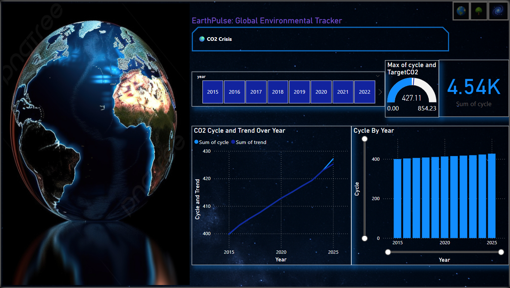
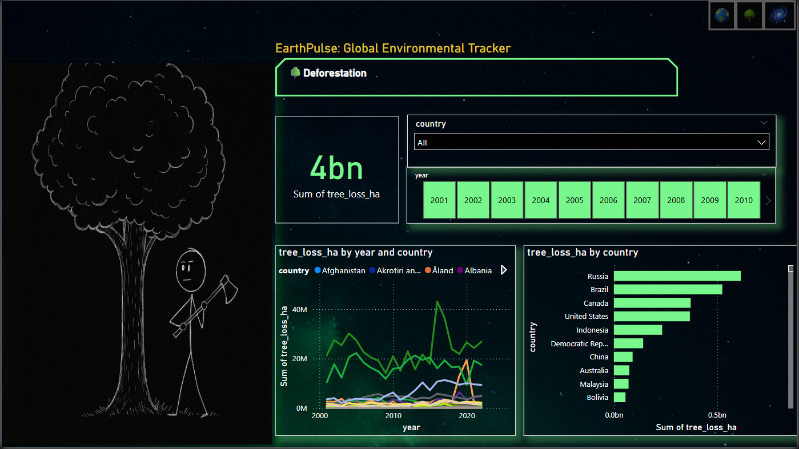
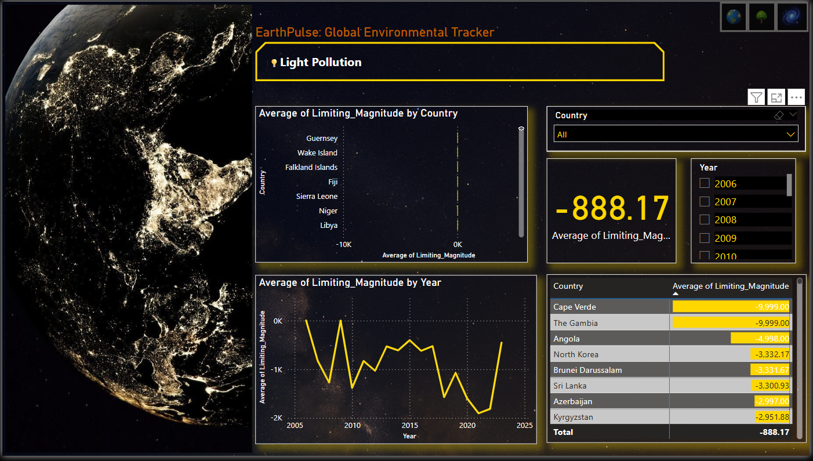

# 🌍 EarthPulse – A Power BI Dashboard for Global Environmental Issues

EarthPulse is a multi-page Power BI dashboard exploring three major environmental challenges our planet faces:

- **CO₂ Emissions**
- **Deforestation**
- **Light Pollution**

Each topic has its own dedicated page with interactive visuals, filters, and clean layouts — designed to give users a clear picture of how these issues evolve over time and across countries.

---

## 📁 Project Contents

- **Power BI dashboard file:** `Earth_Dashboard.pbix`
- **Cleaned datasets** for CO₂, deforestation, and light pollution in CSV format
- **Custom visuals and artwork** to give each page a unique style

## 🔍 What You’ll See in the Dashboard

### 🌫 CO₂ Emissions Page

Tracks CO₂ levels from 2015 to 2022, featuring KPIs and line/bar charts comparing actual levels to target values. The left side shows a static globe image for design.

---

### 🌳 Deforestation Page

Country-wise tree loss data from 2001–2010 with filters for year and country using dropdown menus. Includes a sketch-style visual showing deforestation impact.

---

### 💡 Light Pollution Page

Visualizes limiting magnitude data (night sky visibility) from 2005 to 2025 across countries. Features a dark-themed layout with Earth night maps and trend charts.

---

## 📂 About the Datasets

| File                  | Description                                 |
|-----------------------|---------------------------------------------|
| `co2_emissions.csv`   | CO₂ levels vs targets (2015–2022)           |
| `deforestation.csv`   | Tree loss data by country (2001–2010)       |
| `light_pollution.csv` | Limiting Magnitude index (2005–2025)        |

---

## 💡 Key Features

- Clean, focused visuals for each environmental issue  
- Page navigation using icon buttons  
- Space/Earth themed design with static art and dark mode  
- Year and country filters for detailed insights  
- Trend analysis and KPIs where applicable  

---

## 🔍 Key Insights

- CO₂ emissions remain well above global target levels  
- Tree cover loss is highest in countries like Russia, Brazil, and Canada  
- Light pollution is reducing night sky visibility worldwide  

---

## 🛠️ How to View the Dashboard

1. Download the `Earth_Dashboard.pbix` file  
2. Open it using **Power BI Desktop** (free tool)  
3. Use the top-right navigation icons to switch between pages  
4. Use filters to explore data by year or country  

---

## 📄 License

This project is licensed under the [MIT License](LICENSE).

---

